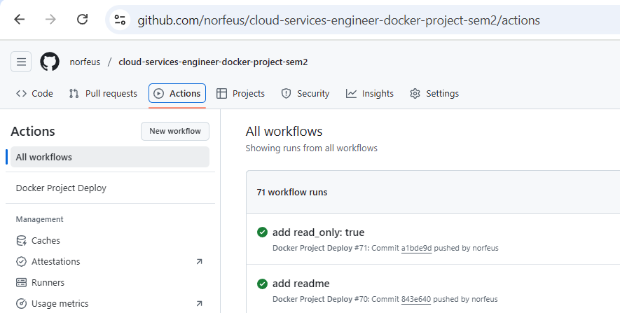
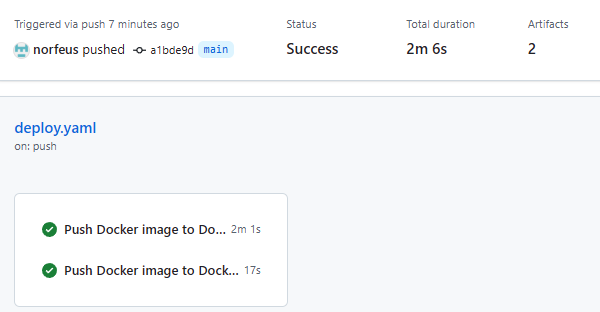
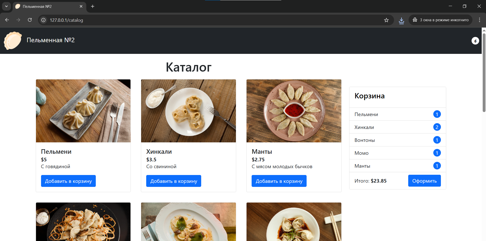

# Cloud Services Engineer Docker Project

Проект по контейнеризации full-stack веб-приложения с использованием Docker, Docker Compose и GitHub Actions.

## Обзор

Этот репозиторий содержит фронтенд и бэкенд части веб-приложения:
- **Backend**: Go API сервер
- **Frontend**: Vue.js SPA

Все компоненты приложения **контейнеризированы**, оптимизированы и безопасны:
- Использованы многоэтапные сборки (`multi-stage builds`)
- Минимальные базовые образы: `gcr.io/distroless/static-debian12`, `-alpine версии`
- Реализованы `healthcheck` и ограничения ресурсов
- Настроен `docker-compose.yml` с сетями, volumes и зависимостями сервисов
- В CI/CD реализовано:
  - Авторизация в Docker Hub
  - Сборка и публикация образов
  - Анализ уязвимостей через Trivy
  - Проверка Dockerfile через Hadolint
  - Генерация SBOM через Syft

---

### Технологии:

| Компонент | Версия | Назначение |
|----------|--------|------------|
| Go       | 1.23   | Backend API server |
| Vue.js   | 3.x    | Frontend SPA |
| Node.js  | 18     | Сборка фронтенда |
| Docker   | latest | Контейнеризация |
| Docker Compose | v2.34.0 | Оркестрация |
| GitHub Actions | - | CI/CD pipeline |
| Trivy    | latest | Сканирование на уязвимости |
| Hadolint | v2     | Проверка Dockerfile |
| Syft     | v0.42.0 | Генерация SBOM |

---

## Установка и запуск

### 1. Клонируйте репозиторий

```bash
git clone https://github.com/norfeus/cloud-services-engineer-docker-project-sem2.git
cd cloud-services-engineer-docker-project-sem2
```

### 2. Соберите и запустите через Docker Compose

```bash
DOCKER_USERNAME=`<DOCKER_USERNAME>` docker-compose up --build
```

После этого:
- Фронтенд будет доступен по адресу: http://localhost
- Бэкенд: http://localhost:8081

---

## Ручная сборка

Если вы хотите собрать и запустить контейнеры вручную:

### Backend

```bash
cd backend
docker build -t <DOCKER_USERNAME>/docker-project-backend:latest .
docker run -d -p 8081:8081 <DOCKER_USERNAME>/docker-project-backend:latest
```

### Frontend

```bash
cd frontend
docker build -t <DOCKER_USERNAME>/docker-project-frontend:latest .
docker run -d -p 80:80 <DOCKER_USERNAME>/docker-project-frontend:latest
```

> Замените `<DOCKER_USERNAME>`

---

## CI/CD Pipeline (GitHub Actions)

### Что делает пайплайн:
1. **Сборка и публикация** образов в Docker Hub
2. **Проверка Dockerfile** через `hadolint`
3. **Анализ уязвимостей** через `trivy-action`
4. **Генерация SBOM** через `syft` для аудита

### Требования:
- Убедитесь, что в GitHub Secrets добавлены:
  - `DOCKER_USER` — ваш логин Docker Hub
  - `DOCKER_PASSWORD` — ваш токен или пароль

---

## Безопасность

- **Не используется root-пользователь** внутри контейнеров
- **Минимальные образы**:
  - Backend: `gcr.io/distroless/static-debian12` (~5MB)
  - Frontend: `debian:12-slim` + `nginx:alpine`
- **Ограничения возможностей контейнеров**:
  - `cap_drop: all`
  - `security_opt: no-new-privileges:true`
- **Healthchecks**:
  - Backend: `wget -q --spider http://localhost:8081/health`
  - Frontend: `cat /etc/os-release` (для `distroless`)
- **Сканер уязвимостей**: `Trivy` интегрирован в CI
- **SBOM**: создаётся через `Syft`

---

## Оптимизация

- **Многоэтапная сборка (multi-stage)** — только необходимые файлы в финальном образе
- **Использование `.dockerignore`**
- **Оптимизация слоёв** — объединённые команды в `RUN`, удаление кэша
- **Уменьшение размера образов**
  - Backend: ~18MB
  - Frontend: ~50MB

---

## Docker Compose

### Особенности:
- Два окружения:
  - `public-network`: для внешнего доступа
  - `internal-network`: для внутренней коммуникации между сервисами
- `depends_on`: frontend зависит от backend
- `restart: unless-stopped`
- `deploy.resources.limits`: CPU и память ограничены


---

## CI/CD Flow (`.github/workflows/deploy.yaml`)

### Этапы:

1. **Build & Push to Docker Hub**
   - Сборка и публикация обоих образов
   - Используются `secrets.DOCKER_USER` и `secrets.DOCKER_PASSWORD`

2. **Security Checks**
   - Проверка Dockerfile через `hadolint`
   - Сканирование на уязвимости через `aquasec/trivy-action`
   - Генерация SBOM через `anchore/syft`

3. **Docker Compose Build**
   - Сборка через `hoverkraft-tech/compose-action@v2.2.0`

---

## Масштабируемость

- Балансировка нагрузки пока не реализована, но может быть добавлена через Nginx/Traefik.

---

## Размеры образов

| Сервис | Базовый образ | Размер |
|-------|---------------|--------|
| Backend | distroless/static-debian12 | ~18MB |
| Frontend | debian:12-slim + nginx | ~50MB |

---

## Автор

norfeus  
[GitHub Profile](https://github.com/norfeus)

---

## TODO

- [ ] Добавить HTTPS через Let's Encrypt
- [ ] Реализовать балансировку нагрузки, горизонтальное масштабирование

---

## Скриншоты 

### Успешно выполненные actions: 

 

 

### Внешний вид web-интерфейса: 

 


